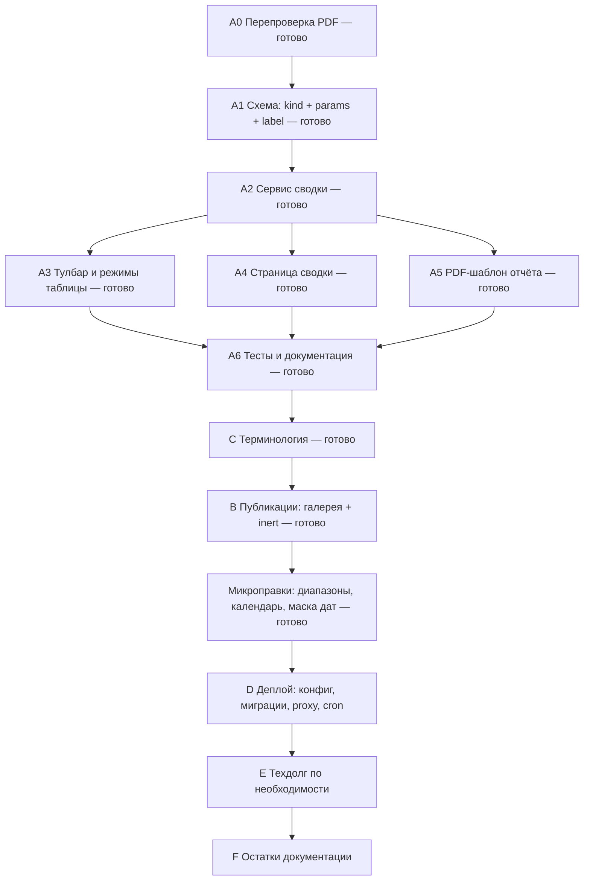

# PLANS.md — план финальной сессии

Активный план работ: финальные правки перед подготовкой проекта к деплою.
Краткий рабочий контекст — в [`AGENTS.md`](AGENTS.md), история — в [`CHANGELOG.md`](CHANGELOG.md),
открытый технический долг — в [`docs/technical-debt.md`](docs/technical-debt.md),
замечания по ручному E2E — в [`NOTES.md`](NOTES.md).

> Дорожная карта MVP и заметки по выполненным сессиям перенесены в
> [`COMPLETED_PLANS.md`](COMPLETED_PLANS.md). Его заголовок внутри файла всё ещё называет себя
> `PLANS.md` — поправить в блоке F.

## Цель сессии

Закрыть последний содержательный блок продукта (отчётность по экспертизам) и подготовить
проект к деплою: прод-конфигурация, миграции, reverse-proxy, документация.

## Статус

**Версия: 1.21.0** (коммит `efe6f81`). Блоки A–C и вычитка интерфейса выполнены;
блоки D–F не начаты — это следующий шаг (подготовка к деплою).

| Блок | Состояние | Что осталось |
| ---- | --------- | ------------ |
| A. Отчётность по экспертизам | ✅ выполнено | открытые хвосты — в A0 и A6 |
| B. Публикации | ✅ выполнено | — |
| C. Терминология | ✅ выполнено | — |
| Микроправки (диапазоны, даты) | ✅ выполнено | — |
| Вычитка интерфейса | ✅ выполнено | — |
| D. Подготовка к деплою | ⬜ не начат | нужны решения D3/D4/D8 |
| E. Технический долг | ⬜ не начат | — |
| F. Документация и версии | ⏳ частично | версии и CHANGELOG сделаны; остались `api-contract.md`, `NOTES.md`, `COMPLETED_PLANS.md` |

## Принятые решения

Зафиксировано в обсуждении; при конфликте с исходной формулировкой ТЗ приоритет у этой таблицы.

| #   | Решение                                                        | Комментарий                                                                                                    |
| --- | -------------------------------------------------------------- | -------------------------------------------------------------------------------------------------------------- |
| 1   | **Единица отчёта — набор экспертиз**                           | Любая выборка в итоге разворачивается в набор `application_reviews`                                            |
| 2   | **Тип отчёта не выбирается вручную**                           | Выводится из режима таблицы и состава выборки (эксперт / заявка / вердикт / произвольный набор)                |
| 3   | **Отчёт «по заявке» не меняется**                              | Существующий PDF заявки (9 секций) остаётся как есть                                                           |
| 4   | **Группировка — в панели инструментов, а не в таблице**        | Таблица получает только необязательный столбец чекбоксов                                                       |
| 5   | **Агрегация — на сервере (вариант «а»)**                       | Одна реализация кормит таблицу, страницу сводки и PDF; иначе разъедется (см. техдолг про расхождение PDF и UI) |
| 6   | **Сортировка — по клику на заголовок**: `asc → desc → default` | В заголовках таблицы, не в тулбаре                                                                             |
| 7   | **Сводки доступны только администратору**                      | У эксперта остаётся простая таблица без нового функционала                                                     |
| 8   | **Параллелизм и очередь не развиваем**                         | Отчёты создаёт один администратор; `1 отчёт = 1 задание`                                                       |
| 9   | **Скачивание — через тост с кнопкой**                          | Используем существующий `ToastOptions.action`; `window.open` после поллинга блокируется браузером              |
| 10  | **Выделение сбрасывается при смене группировки**               | Ключи строк в разных режимах имеют разную природу (id экспертизы / эксперта / вердикта)                        |
| 11  | **Режим таблицы — состояние URL**                              | Параметр `?group=…`; страница шарится ссылкой и переживает F5                                                  |

### Модель строк по режимам

| Режим                                                 | Строка =                                           | Число строк    | Чекбокс   |
| ----------------------------------------------------- | -------------------------------------------------- | -------------- | --------- |
| 0. Обычная (как сейчас)                               | экспертиза                                         | все записи     | нет       |
| 1. Без группировки                                    | экспертиза (заявка × эксперт)                      | все записи     | на каждой |
| N. С группировкой (эксперт / вердикт / оценка / дата) | агрегат: эксперт, вердикт, диапазон оценки, период | по числу групп | на группе |

Во всех режимах действуют поиск и фильтры. В режимах 0/1 одна строка = одна запись,
в режиме N одна строка = несколько записей. Клик по заголовку сортирует, группировка
переключается в тулбаре.

---

## Блок A. Отчётность по экспертизам

Самая крупная часть: схема + сервис + страница + PDF + доработка таблицы.

### A0. Перепроверка и починка существующего PDF-конвейера — выполнено (кроме двух отложенных пунктов ниже)

Проверено в коде (факты):

- Задание: таблица `pdf_export_jobs` (`status`, `file_id`, `error`, индекс по `status`);
  есть watchdog 5 мин, обработка аварийного завершения воркера, повторное скачивание
  готового файла (артефакт неизменяемый — PDF лежит в `files`).
- **Обработчика очереди нет**: `startExport` сразу `spawn`-ит процесс на задание;
  записи `pending` после рестарта сервера никто не подхватывает.
- **Нет ограничения параллелизма**: N заданий = N процессов `bun`, каждый грузит шрифты.
- **`processing` остаётся «вечным»** после рестарта сервера (в `index.ts` нет восстановления).
- `file_categories` — мёртвая таблица: единственное упоминание в коде — `scripts/reset-db.ts`
  (для очистки). Как «заготовку под отчёты» её рассматривать нельзя.

Найдено при перепроверке (в список задач):

- [x] **Скачивание блокируется браузером.** `PdfExportButton` открывал файл через
      `window.open` после `setTimeout`-поллинга. Заменено на тост с кнопкой «Скачать»
      (`lib/use-pdf-export.ts`, использует `ToastOptions.action`).
- [x] **Рассогласование таймаутов.** UI сдавался через 120 с, серверный watchdog — 300 с.
      Теперь `PDF_MAX_ATTEMPTS` (200 × 1,5 с = 300 с) совпадает с `WORKER_TIMEOUT_MS`.
- [x] **`processing` после рестарта.** Добавлен `recoverStaleJobs()` — вызывается при старте
      сервера в `index.ts`, помечает застрявшие задания ошибкой.
- [x] Проверено живьём: отчёт по заявке, сводка по заявке, сводка по всем экспертизам,
      сводка по эксперту — файлы генерируются, начинаются с `%PDF-`.
- [ ] **Нет дедупликации на сервере** (отложено): повторный клик создаёт второе задание;
      на клиенте защищает только флаг `busy`. При одном администраторе риск низкий.
- [ ] Проверить скачивание готового файла после перезапуска backend (ручной E2E).

### A1. Схема задания — выполнено

Обобщение `pdf_export_jobs` вместо новой таблицы (переиспользуем воркер, роуты, поллинг):

| Поле             | Назначение                                                                                                            |
| ---------------- | --------------------------------------------------------------------------------------------------------------------- |
| `kind`           | тип отчёта; значения — enum в `@arbuz/shared` (по аналогии с `PdfExportStatus`)                                       |
| `params Json`    | критерии отбора: `{ expert_id }` / `{ status_id }` / `{ application_id }` / `{ review_ids: [...] }` / `{ all: true }` |
| `label`          | человекочитаемое имя отчёта для списка/тоста, чтобы UI не разбирал JSON                                               |
| `application_id` | сделать nullable (заполнен только для отчёта по заявке)                                                               |

Почему `params`, а не список id: список экспертиз не пагинирован, фильтрация сейчас клиентская —
отчёт по id был бы ограничен тем, что загружено в браузер. С критериями отбора отчёт строится
по всей базе.

Учесть:

- Параметры валидировать через `lib/parse.ts` (`parseId`, `oneOf`).
- **Целостность набора id не гарантирована**: если экспертизу снимут между созданием задания
  и рендером — пропустить и пометить в PDF «экспертиза снята», а не падать.
- **Артефакт неизменяем**: повторный запуск = новый отчёт (снимок на момент генерации).
- Значения `kind` во фронтенде — только зеркалом (правило «из `@arbuz/shared` — только
  `import type`»), как сделано для `PdfExportStatuses` в `api/pdf-export.ts`.

### A2. Сервис сводки — единый источник данных — выполнено

`modules/reviews/summary.service.ts`: принимает параметры отбора (те же, что уходят в `params`)
и возвращает:

- шапку (тип и подпись: эксперт / заявка / вердикт / произвольная выборка);
- итоги: число экспертиз, заявок, экспертов, средний балл, распределение вердиктов,
  средние по критериям;
- строки для таблицы/PDF.

**Одна функция обслуживает** `GET /api/reviews/summary` (таблица в режиме N и страница сводки)
и воркер PDF. Это главное требование блока: не допустить второго расхождения PDF и интерфейса.

### A3. Панель инструментов и режимы таблицы — выполнено

- [x] `Table`: один новый **generic**-пропс `selection`. В ходе вычитки контракт уточнён:
      вместо набора ключей — `isSelected(row)` + `onToggle(row)` (таблица больше не сверяет
      строки со своим `rowKey`, из-за чего чекбоксы не отмечались).
      Больше таблица не меняется; группировку внутрь не тащим.
- [x] Сортировка по клику на заголовок: `asc → desc → default` (в плоском и сгруппированном
      режимах — на клиенте, список небольшой). Есть `aria-sort` и визуальный индикатор.
- [x] Чекбокс строки не trigger'ит `onRowClick` (остановка всплытия).
- [x] Панель инструментов: поиск + фильтры + **группировка** в одной панели
      (`ListToolbar`); группировка значениями: без группировки / по эксперту / по вердикту /
      по оценке (диапазоны по 5 баллов) / по дате (месяцы).
- [x] Колонки строятся по режиму: у агрегатной строки вместо «Вердикт/Балл» — «Экспертиз»,
      «Заявок», «Средний балл», распределение вердиктов.
- [x] Логику группировки/агрегации вынесена в **чистый модуль** `lib/review-grouping.ts`
      и покрыта смоук-тестом `review-grouping.smoke.ts`.
- [x] Режим хранится в URL (`?group=…`); смена группировки сбрасывает выделение.

### A4. Страница сводки — выполнено

Отдельный маршрут (`/admin/reviews/summary?expert_id=… | status_id=… | review_ids=…`), не модалка:
ссылка шарится, F5 не теряет состояние, и не повторяем историю с `z-index` MDXEditor.
Компонент — `features/reviews/ReviewsSummaryPage.tsx`, вид — из `components/ui`.

### A5. PDF-шаблон отчёта — выполнено

Отдельный шаблон `modules/pdf-export/reviews-document.ts`: блок итогов (в т.ч. распределение
вердиктов и средние по критериям) + секция на каждую экспертизу с названиями критериев.
Шаблон заявки (`pdf-document.ts`) не тронут.

### A6. Тесты и документация

- [x] Смоук: группировка и агрегация (чистая логика), отбор по `params`, состав сводки,
      права на задание сводки — `tests/smoke/review-grouping.smoke.ts`,
      `tests/smoke/reviews-summary.smoke.ts`.
- [x] `README.md` (разделы API, Frontend, Тестирование) и `docs/technical-debt.md`.
- [ ] `docs/api-contract.md` (отстаёт с 1.18.0) — перенесено в блок F.

---

## Блок B. Публикации — выполнено

- [x] **Карусель изображений в тексте публикации.** Несколько картинок, вставленных подряд,
      сервер собирает в блок `post-gallery` **после** санитайзера
      (`groupImageParagraphs` в `modules/posts/markdown.ts`), а фронтенд разрезает текст по этому
      блоку и показывает галерею компонентом `Carousel` (`features/posts/PostContent` +
      `lib/post-content.ts`). Отдельного синтаксиса у автора нет — достаточно вставить несколько
      изображений; одиночная картинка и картинка внутри абзаца с текстом остаются как есть.
      Обёртка добавляется после санитайзера, поэтому `div` в allowlist расширять не пришлось.
- [x] **`Carousel` — `inert`** на неактивных слайдах (скрытые слайды сохраняли фокусируемые
      элементы).

## Блок C. Терминология (патч) — выполнено

- [x] `ExpertEvaluationSection.tsx` — поле «Текст экспертизы» → **«Комментарий эксперта»**
      (других вхождений формулировки в коде нет).
- [x] Заголовок раздела «Экспертизы» не трогаем — терминология закреплена в `AGENTS.md`.

## Блок D. Подготовка к деплою — следующий шаг

- [ ] **D1. Прод-переменные.** Дописать `.env.example` (прод-раздел): `NODE_ENV`, `PORT`,
      `DATABASE_URL`, `JWT_SECRET`, `ADMIN_EMAIL`, `ADMIN_PASSWORD`, `UPLOAD_DIR`
      (абсолютный путь вне статики).
- [ ] **D2. Cookie/HTTPS.** `secure: isProduction` уже есть — задокументировать обязательный
      HTTPS и `X-Forwarded-Proto`; при необходимости `trust proxy`.
- [ ] **D3. Ротация `logs/audit.log`.** Сейчас синхронный `appendFileSync` без ротации.
      Решить: делать сейчас или писать в stdout и отдать ротацию внешнему инструменту.
- [ ] **D4. Миграции.** В репозитории нет `migrations/` — решить: завести начальную миграцию
      и деплоить `migrate deploy` или жить на `db:push` без истории (для прод-БД принципиально).
- [ ] **D5. Инициализация прода.** `bun seed` создаёт админа из `ADMIN_*`; демо-данные
      отключены (`SEED_DEMO=false` / `NODE_ENV=production`). Зафиксировать как шаг деплоя.
- [ ] **D6. Обслуживание.** `storage:cleanup` в cron, бэкапы БД + `uploads/` + `logs/`,
      права `640/750`, запрет исполнения в `uploads/`, каталог вне статики.
- [ ] **D7. Reverse-proxy.** Пример конфига: раздача `dist` фронтенда, `/api` → backend,
      `client_max_body_size` с запасом к лимиту 10 МБ, таймауты под поллинг PDF,
      SPA-fallback `try_files … /index.html`.
- [ ] **D8. Запуск backend на сервере.** systemd-юнит (или решение использовать Docker).
- [ ] **D9. Прод-подобная проверка.** `bun run build`, `bun test:smoke`, ручной E2E в трёх ролях
      (пункт висит в бэклоге как обязательный).

## Микроправки после блоков A–C (выполнено)

- [x] **Поля диапазонов в панели инструментов** раздела «Экспертизы»: скрыты по умолчанию,
      появляются в своей группировке (оценка — при группировке по оценке, период — по дате).
      Пока пользователь не трогал диапазон, он не фильтрует: смена группировки не меняет состав списка.
- [x] **`RangeSlider`** — числовой диапазон двумя бегунками (наложенные нативные
      `input[type=range]`: оба доступны с клавиатуры); чистая логика — `Form/range-state.ts`
      (границы не перескакивают друг через друга, шаг и границы прижимаются).
- [x] **`RangeDatePicker` + доработка календаря**: общий `CalendarPanel` показывает один или
      **два месяца** сразу, клик по месяцу открывает **выбор года** с переходами по десятилетиям
      (±10) и столетиям (±100). Позиционирование и закрытие попапа вынесены в `usePopover`
      (следит за размером попапа через `ResizeObserver`).

## Финальная вычитка интерфейса (выполнено)

- [x] **Чекбоксы в таблице не отмечались.** `Table` сверял выбранные строки со своим `rowKey`,
      а страница хранила ключи строками: числа и строки не совпадали. API заменён на
      `selection.isSelected(row)` — решение принимает страница, расхождение ключей невозможно.
- [x] **Смена группировки больше не фильтрует список** (в режиме «по оценке» пропадали
      экспертизы без балла до того, как пользователь трогал ползунок).
- [x] **`DateInput`** — поле даты с маской `дд.мм.гггг` (отсев несуществующих дат,
      неполный ввод не уходит наружу); чистая логика — `Form/date-mask.ts`.
- [x] **`DateRangeInput`** — период двумя полями с маской и кнопкой календаря между ними;
      поля и календарь связаны одним значением (`DateRange`). Попап периода вынесен
      в `RangeCalendarPopup` и общий с `RangeDatePicker`.
- [x] **«План мероприятий»** в карточке заявки переведён на `DateRangeInput`:
      даты можно вводить вручную или выбирать в календаре.
- [x] **`DesignSystemPage`** дополнена: `RangeSlider`, `DateInput`, `DateRangeInput`,
      `RangeDatePicker`, варианты календаря (1 и 2 месяца), чекбоксы, таблица с выбором строк
      и сортировкой, `StateMessage`/`Pagination`, модальное окно и `ConfirmDialog`, `SectionHint`.

## Блок E. Технический долг — только то, что мешает деплою

- [ ] `PASSWORD_MIN_LENGTH` — использовать из `auth/credentials.ts` вместо дубля.
- [ ] Тайминг-энумерация email при входе (`auth.routes.ts`).
- [ ] _(опционально)_ вынести бизнес-логику из `files.routes.ts` (самый «толстый» роут).
- [ ] _(отложить)_ `consent_file_path` → nullable, дубли `lib/parse.ts`, `DocNode = any`,
      `IconName = string`, типизация `Select`, пагинация `/api/reviews`, `tokens.css`.

## Блок F. Документация и версии — частично

- [x] Поднять версии синхронно в `apps/backend`, `apps/frontend`, `packages/shared`
      (1.20.2 → 1.21.0) + `bun install` (обновлён `bun.lock`).
- [x] `CHANGELOG.md` — запись `[1.21.0]` (Added / Changed / Fixed / Схема БД) с указанием,
      что после обновления нужны `bun db:push` и `bun db:generate`.
- [x] `README.md` — новые эндпоинты (отчёты и сводка), режимы таблицы, диапазоны и даты,
      галерея публикаций, состав смоук-тестов.
- [x] `docs/technical-debt.md` — отмечено закрытое (`Carousel` `inert`, очередь PDF-заданий),
      уточнён пункт про поиск в списках.
- [ ] `docs/api-contract.md` — дописать 1.19–1.21+ (новые эндпоинты пока только в `README.md`).
- [ ] `COMPLETED_PLANS.md` — поправить заголовок внутри файла (называет себя `PLANS.md`).
- [ ] `NOTES.md` — перенести закрытые блоки, оставить открытые.
- [ ] `README.md` — раздел «Деплой» (после выполнения блока D).

Коммит сессии: `efe6f81` — «Add review reports, ranges, galleries (1.21.0)».

---

## Порядок работ

Смысл порядка: A2 (сервис сводки) — точка, от которой зависят и таблица, и страница, и PDF.
Таблица — самая рискованная часть по UX, поэтому делается последней, когда данные и документ
уже проверены. Блок C можно было сделать в любой момент — он не зависит ни от чего.

## Открытые вопросы

Решённые вопросы оставлены для контекста — решения уже в коде и описаны в `CHANGELOG.md`.

1. ✅ **Режим 1: строка — это экспертиза (пара заявка × эксперт).** Так и реализовано:
   без группировки строка = одна экспертиза; в режимах с группировкой одна строка = набор
   экспертиз (`GroupedRow` с `reviewIds`).
2. ✅ **Диапазоны группировки.** Диапазон — это **фильтр отбора**, а не фиксированные корзины:
   `RangeSlider` (шаг 1 балл, границы берутся из данных) и `RangeDatePicker` (дата обновления).
   Внутри выбранного диапазона строки по-прежнему группируются по 5 баллам и по месяцам.
   Поля скрыты и появляются только в своей группировке; пока диапазон не тронут — он не фильтрует.
3. ⬜ **Повторное скачивание отчётов.** Пока всегда формируется новый отчёт (снимок на момент
   генерации); список «Мои отчёты» со ссылками на готовые PDF не делали — поле `label`
   в `pdf_export_jobs` оставлено заделом.
4. ✅ **Версионирование.** Вся сессия — одна версия 1.21.0 (блоки A–C и микроправки),
   коммит `efe6f81`. Дальше: блок D+E+F — отдельная версия (1.22.0) по масштабу.
5. ⬜ **D3/D4/D8** (ротация логов, миграции, systemd/Docker) — решения уровня деплоя,
   нужны до старта блока D.

## Ограничения, которые соблюдаем

- Компоненты — только из `components/ui`; статусы/роли/типы — без магических строк
  (значения из `@arbuz/shared` + локальные зеркала; во фронтенде — только `import type`).
- Схема БД — SSOT: правки только при осознанной необходимости (в блоке A — обоснованы).
- Модальные окна по умолчанию не закрываются кликом мимо и по Esc.
- «Опасные» и необратимые действия — с подтверждением и возможностью отмены.
